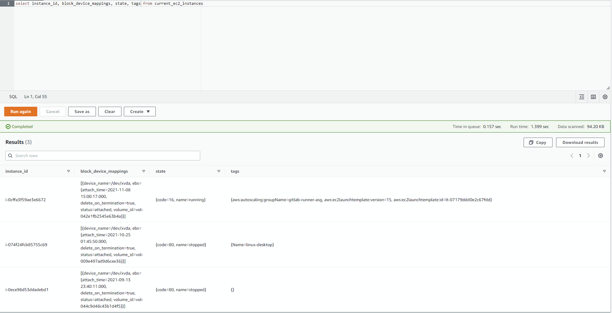
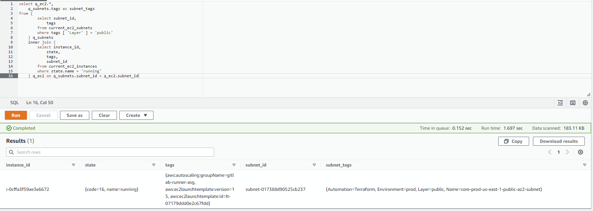
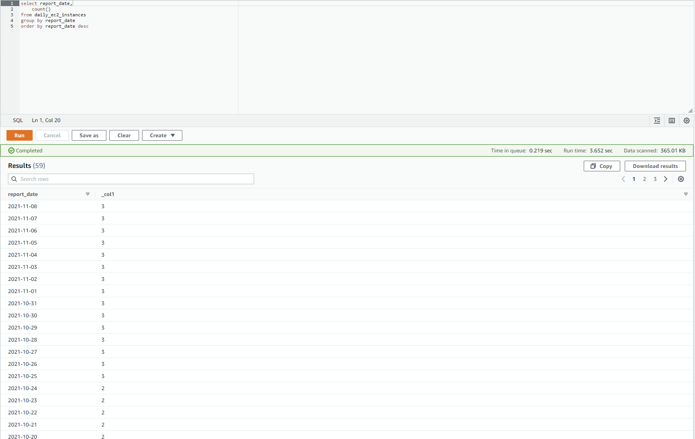

One of the most common questions asked to an enterprise cloud hosting team is "what does our current footprint look like?". This question is often accompanied by criteria such as "how does it compare to this time last week/month/year?" or "show me the details specific to applications under this parent organization"

While the different cloud providers offer great APIs for pulling data like this ad-hoc, it can often be quite cumbersome to write custom scripts that go out and fetch this type of information from all the necessary sources. Worse yet, historic data isn't always available in an easy-to-consume fashion.

**That's where I got the idea for cloud-inventory, a system which collects periodic snapshots of your entire cloud infrastructure via the available APIs, and exposes an interface to allow you to query that data in a familiar SQL format, allowing you to pull insights in minutes rather than needing to write custom scripts.**

The major benefits of cloud-inventory are its completely serverless implementation, and its use of automated code generation to define the database models and ingestion code, enabling near 1-to-1 mappings between a cloud providers resource fields and the objects in the database. This means almost anything which you can query find in the API can be used to construct queries in the database. The fact that it's serverless means there is almost no operational upkeep of the system, just run the docker container on whatever schedule you desire, and start querying the data using the AWS Athena console or visualize it in Quicksight

The source code for cloud-inventory can be found at https://github.com/sheacloud/cloud-inventory

## Tech Stack

cloud-inventory is developed in Go, and has concurrency designed in from the start to allow for quick data ingestion of large environments, and has the ability to be scaled both vertically and horizontally to meet data ingestion timeline requirements.

The backend data store is all based on S3 with files being stored in the Apache Parquet format. These files are stored in a directory structure that is indexed off of the cloud, service (i.e. EC2), resource (i.e. instances), and the date of the ingestion (i.e. 2021-11-08). This allows Athena, the query engine, to effectively find the data that it needs to scan for a given query, resulting in quick queries with minimal costs for scanning the data.

AWS Athena (a managed PrestoDB implementation) allows users you quickly query this data in S3 using SQL, allowing complex queries to be written to look for very specific information across the environment.

AWS Quicksight can be integrated with Athena to allow users to create visualization of data queried by Athena. This enables you to create high-level dashboards showcasing current cloud footprint, and outline historic trends in the environment such as service usage over time, what technologies your applications are using, etc.

## Automated code generation

A big difficulty in implementing a solution like cloud-inventory is that there are *a lot* of resources within public clouds, each of which has many fields, relationships, and they are being updated all the time by the cloud providers. Developing database models to accurately represent these cloud resources is a never ending battle, ripe with opportunity for bugs (missing a field, typos, going crazy from writing hundreds of data models).

The silver lining is that the cloud providers face this same issue with developing their SDKs - they can't possibly write individual SDKs for all the major programming languages and keep them up to date and bug free. Instead, they have a strict API spec which is used to automatically generate the code for their various SDKs, such as Go, Python, Java, etc. The benefit of this is that the SDK code follows a very consistent pattern, making it possible to write generic code to fetch data from these APIs, and convert the responses into a Parquet format.

Using Go's compilation toolset, we can partially compile the SDKs of something like AWS's EC2 service, giving us access to their data models in a somewhat friendly format. From that, we generate code based on templates that map these fields to their Parquet counterparts, and embed child resources, custom fields, or data conversions into the models. We can use this same compiled information to generate the terraform templates needed to define the data schemas in AWS, as well as pre-defined SQL views to provide more friendly interfaces to the datasets.

### Code generation in action

The following is an example of the code generation utilities being used in the project. We want to model AWS EC2 instances (their VM offering). We can generate these models based on the AWS SDK source code. cloud-inventory uses specification files which outline what cloud resources we want to model, and what source code to based those models on (along with some transformation options, etc). An example of this spec for EC2 instances is the following

```hcl
service "aws" "ec2" {
    library_path = "github.com/aws/aws-sdk-go-v2/service/ec2"

    datasource "instances" {
        primary_object_name = "Instance"
        primary_object_field = "InstanceId"
        api_function = "DescribeInstances"
        primary_object_path = ["Reservations", "Instances"]
        models_only = false
        paginate = true

        field_conversion {
            source_field_name = "Tags"
            source_field_name_override = "TagsOld"
            target_field_name = "Tags"
            target_field_type = "map[string]string"
            conversion_function_name = "GetTagMap"
        }
    }
}
```

This tells the service that we want to model the "Instance" object from the package github.com/aws/aws-sdk-go-v2/service/ec2. It also specifies what API call to use to fetch the resource (DescribeInstances), the location of the resulting resources in the API response (.Reservations.Instances), and that we want to convert the Tags field from a list of tags into a string map using the pre-defined function "GetTagMap".

By running the [model-generator](https://github.com/sheacloud/cloud-inventory/blob/main/cmd/model-generator/model-generator.go) utility, we can compile the code found at github.com/aws/aws-sdk-go-v2/service/ec2, inspect the "Instance" struct and all it's fields, and generate code which implements a function to fetch this resource from the AWS API, and convert the response into a new Go struct which implements Parquet marshalling.

Example output of this running against the previously shown service spec would be:

```go
// AUTOGENERATED, DO NOT EDIT
package ec2

import (
	"fmt"
	"github.com/jinzhu/copier"
	"github.com/sheacloud/cloud-inventory/internal/storage"
	"github.com/sirupsen/logrus"
	"time"

	"context"
	"github.com/aws/aws-sdk-go-v2/aws"
	"github.com/aws/aws-sdk-go-v2/service/ec2"
	"sync"
)

var customInstanceModelPostprocessingFuncs []func(ctx context.Context, client *ec2.Client, cfg aws.Config, x *InstanceModel) = []func(ctx context.Context, client *ec2.Client, cfg aws.Config, x *InstanceModel){}
var customInstanceModelFuncsLock sync.Mutex

func registerCustomInstanceModelPostprocessingFunc(f func(ctx context.Context, client *ec2.Client, cfg aws.Config, x *InstanceModel)) {
	customInstanceModelFuncsLock.Lock()
	defer customInstanceModelFuncsLock.Unlock()

	customInstanceModelPostprocessingFuncs = append(customInstanceModelPostprocessingFuncs, f)
}

func init() {
	Controller.RegisterDataSource("instances", InstanceDataSource)
}

type InstanceModel struct {
	AmiLaunchIndex                          int32                                                  `parquet:"name=ami_launch_index,type=INT32"`
	Architecture                            string                                                 `parquet:"name=architecture,type=BYTE_ARRAY,convertedtype=UTF8"`
	BlockDeviceMappings                     []*InstanceBlockDeviceMappingInstanceModel             `parquet:"name=block_device_mappings,type=MAP,convertedtype=LIST"`
	BootMode                                string                                                 `parquet:"name=boot_mode,type=BYTE_ARRAY,convertedtype=UTF8"`
	CapacityReservationId                   string                                                 `parquet:"name=capacity_reservation_id,type=BYTE_ARRAY,convertedtype=UTF8"`
	CapacityReservationSpecification        *CapacityReservationSpecificationResponseInstanceModel `parquet:"name=capacity_reservation_specification"`
	ClientToken                             string                                                 `parquet:"name=client_token,type=BYTE_ARRAY,convertedtype=UTF8"`
	CpuOptions                              *CpuOptionsInstanceModel                               `parquet:"name=cpu_options"`
	EbsOptimized                            bool                                                   `parquet:"name=ebs_optimized,type=BOOLEAN"`
	ElasticGpuAssociations                  []*ElasticGpuAssociationInstanceModel                  `parquet:"name=elastic_gpu_associations,type=MAP,convertedtype=LIST"`
	ElasticInferenceAcceleratorAssociations []*ElasticInferenceAcceleratorAssociationInstanceModel `parquet:"name=elastic_inference_accelerator_associations,type=MAP,convertedtype=LIST"`
	EnaSupport                              bool                                                   `parquet:"name=ena_support,type=BOOLEAN"`
	EnclaveOptions                          *EnclaveOptionsInstanceModel                           `parquet:"name=enclave_options"`
	HibernationOptions                      *HibernationOptionsInstanceModel                       `parquet:"name=hibernation_options"`
	Hypervisor                              string                                                 `parquet:"name=hypervisor,type=BYTE_ARRAY,convertedtype=UTF8"`
	IamInstanceProfile                      *IamInstanceProfileInstanceModel                       `parquet:"name=iam_instance_profile"`
	ImageId                                 string                                                 `parquet:"name=image_id,type=BYTE_ARRAY,convertedtype=UTF8"`
	InstanceId                              string                                                 `parquet:"name=instance_id,type=BYTE_ARRAY,convertedtype=UTF8" inventory_primary_key:"true"`
	InstanceLifecycle                       string                                                 `parquet:"name=instance_lifecycle,type=BYTE_ARRAY,convertedtype=UTF8"`
	InstanceType                            string                                                 `parquet:"name=instance_type,type=BYTE_ARRAY,convertedtype=UTF8"`
	KernelId                                string                                                 `parquet:"name=kernel_id,type=BYTE_ARRAY,convertedtype=UTF8"`
	KeyName                                 string                                                 `parquet:"name=key_name,type=BYTE_ARRAY,convertedtype=UTF8"`
	LaunchTime                              *time.Time
	Licenses                                []*LicenseConfigurationInstanceModel          `parquet:"name=licenses,type=MAP,convertedtype=LIST"`
	MetadataOptions                         *InstanceMetadataOptionsResponseInstanceModel `parquet:"name=metadata_options"`
	Monitoring                              *MonitoringInstanceModel                      `parquet:"name=monitoring"`
	NetworkInterfaces                       []*InstanceNetworkInterfaceInstanceModel      `parquet:"name=network_interfaces,type=MAP,convertedtype=LIST"`
	OutpostArn                              string                                        `parquet:"name=outpost_arn,type=BYTE_ARRAY,convertedtype=UTF8"`
	Placement                               *PlacementInstanceModel                       `parquet:"name=placement"`
	Platform                                string                                        `parquet:"name=platform,type=BYTE_ARRAY,convertedtype=UTF8"`
	PrivateDnsName                          string                                        `parquet:"name=private_dns_name,type=BYTE_ARRAY,convertedtype=UTF8"`
	PrivateIpAddress                        string                                        `parquet:"name=private_ip_address,type=BYTE_ARRAY,convertedtype=UTF8"`
	ProductCodes                            []*ProductCodeInstanceModel                   `parquet:"name=product_codes,type=MAP,convertedtype=LIST"`
	PublicDnsName                           string                                        `parquet:"name=public_dns_name,type=BYTE_ARRAY,convertedtype=UTF8"`
	PublicIpAddress                         string                                        `parquet:"name=public_ip_address,type=BYTE_ARRAY,convertedtype=UTF8"`
	RamdiskId                               string                                        `parquet:"name=ramdisk_id,type=BYTE_ARRAY,convertedtype=UTF8"`
	RootDeviceName                          string                                        `parquet:"name=root_device_name,type=BYTE_ARRAY,convertedtype=UTF8"`
	RootDeviceType                          string                                        `parquet:"name=root_device_type,type=BYTE_ARRAY,convertedtype=UTF8"`
	SecurityGroups                          []*GroupIdentifierInstanceModel               `parquet:"name=security_groups,type=MAP,convertedtype=LIST"`
	SourceDestCheck                         bool                                          `parquet:"name=source_dest_check,type=BOOLEAN"`
	SpotInstanceRequestId                   string                                        `parquet:"name=spot_instance_request_id,type=BYTE_ARRAY,convertedtype=UTF8"`
	SriovNetSupport                         string                                        `parquet:"name=sriov_net_support,type=BYTE_ARRAY,convertedtype=UTF8"`
	State                                   *InstanceStateInstanceModel                   `parquet:"name=state"`
	StateReason                             *StateReasonInstanceModel                     `parquet:"name=state_reason"`
	StateTransitionReason                   string                                        `parquet:"name=state_transition_reason,type=BYTE_ARRAY,convertedtype=UTF8"`
	SubnetId                                string                                        `parquet:"name=subnet_id,type=BYTE_ARRAY,convertedtype=UTF8"`
	TagsOld                                 []*TagInstanceModel
	VirtualizationType                      string            `parquet:"name=virtualization_type,type=BYTE_ARRAY,convertedtype=UTF8"`
	VpcId                                   string            `parquet:"name=vpc_id,type=BYTE_ARRAY,convertedtype=UTF8"`
	LaunchTimeMilli                         int64             `parquet:"name=launch_time_milli,type=INT64,convertedtype=TIMESTAMP_MILLIS"`
	Tags                                    map[string]string `parquet:"name=tags,type=MAP,keytype=BYTE_ARRAY,valuetype=BYTE_ARRAY,keyconvertedtype=UTF8,valueconvertedtype=UTF8"`
	AccountId                               string            `parquet:"name=account_id,type=BYTE_ARRAY,convertedtype=UTF8"`
	Region                                  string            `parquet:"name=region,type=BYTE_ARRAY,convertedtype=UTF8"`
	ReportTime                              int64             `parquet:"name=report_time,type=INT64,convertedtype=TIMESTAMP_MILLIS"`
}

type InstanceBlockDeviceMappingInstanceModel struct {
	DeviceName string                               `parquet:"name=device_name,type=BYTE_ARRAY,convertedtype=UTF8"`
	Ebs        *EbsInstanceBlockDeviceInstanceModel `parquet:"name=ebs"`
}

type EbsInstanceBlockDeviceInstanceModel struct {
	AttachTime          *time.Time
	DeleteOnTermination bool   `parquet:"name=delete_on_termination,type=BOOLEAN"`
	Status              string `parquet:"name=status,type=BYTE_ARRAY,convertedtype=UTF8"`
	VolumeId            string `parquet:"name=volume_id,type=BYTE_ARRAY,convertedtype=UTF8"`
	AttachTimeMilli     int64  `parquet:"name=attach_time_milli,type=INT64,convertedtype=TIMESTAMP_MILLIS"`
}

type CapacityReservationSpecificationResponseInstanceModel struct {
	CapacityReservationPreference string                                          `parquet:"name=capacity_reservation_preference,type=BYTE_ARRAY,convertedtype=UTF8"`
	CapacityReservationTarget     *CapacityReservationTargetResponseInstanceModel `parquet:"name=capacity_reservation_target"`
}

type CapacityReservationTargetResponseInstanceModel struct {
	CapacityReservationId               string `parquet:"name=capacity_reservation_id,type=BYTE_ARRAY,convertedtype=UTF8"`
	CapacityReservationResourceGroupArn string `parquet:"name=capacity_reservation_resource_group_arn,type=BYTE_ARRAY,convertedtype=UTF8"`
}

type CpuOptionsInstanceModel struct {
	CoreCount      int32 `parquet:"name=core_count,type=INT32"`
	ThreadsPerCore int32 `parquet:"name=threads_per_core,type=INT32"`
}

type ElasticGpuAssociationInstanceModel struct {
	ElasticGpuAssociationId    string `parquet:"name=elastic_gpu_association_id,type=BYTE_ARRAY,convertedtype=UTF8"`
	ElasticGpuAssociationState string `parquet:"name=elastic_gpu_association_state,type=BYTE_ARRAY,convertedtype=UTF8"`
	ElasticGpuAssociationTime  string `parquet:"name=elastic_gpu_association_time,type=BYTE_ARRAY,convertedtype=UTF8"`
	ElasticGpuId               string `parquet:"name=elastic_gpu_id,type=BYTE_ARRAY,convertedtype=UTF8"`
}

type ElasticInferenceAcceleratorAssociationInstanceModel struct {
	ElasticInferenceAcceleratorArn                  string `parquet:"name=elastic_inference_accelerator_arn,type=BYTE_ARRAY,convertedtype=UTF8"`
	ElasticInferenceAcceleratorAssociationId        string `parquet:"name=elastic_inference_accelerator_association_id,type=BYTE_ARRAY,convertedtype=UTF8"`
	ElasticInferenceAcceleratorAssociationState     string `parquet:"name=elastic_inference_accelerator_association_state,type=BYTE_ARRAY,convertedtype=UTF8"`
	ElasticInferenceAcceleratorAssociationTime      *time.Time
	ElasticInferenceAcceleratorAssociationTimeMilli int64 `parquet:"name=elastic_inference_accelerator_association_time_milli,type=INT64,convertedtype=TIMESTAMP_MILLIS"`
}

type EnclaveOptionsInstanceModel struct {
	Enabled bool `parquet:"name=enabled,type=BOOLEAN"`
}

type HibernationOptionsInstanceModel struct {
	Configured bool `parquet:"name=configured,type=BOOLEAN"`
}

type IamInstanceProfileInstanceModel struct {
	Arn string `parquet:"name=arn,type=BYTE_ARRAY,convertedtype=UTF8"`
	Id  string `parquet:"name=id,type=BYTE_ARRAY,convertedtype=UTF8"`
}

type LicenseConfigurationInstanceModel struct {
	LicenseConfigurationArn string `parquet:"name=license_configuration_arn,type=BYTE_ARRAY,convertedtype=UTF8"`
}

type InstanceMetadataOptionsResponseInstanceModel struct {
	HttpEndpoint            string `parquet:"name=http_endpoint,type=BYTE_ARRAY,convertedtype=UTF8"`
	HttpProtocolIpv6        string `parquet:"name=http_protocol_ipv6,type=BYTE_ARRAY,convertedtype=UTF8"`
	HttpPutResponseHopLimit int32  `parquet:"name=http_put_response_hop_limit,type=INT32"`
	HttpTokens              string `parquet:"name=http_tokens,type=BYTE_ARRAY,convertedtype=UTF8"`
	State                   string `parquet:"name=state,type=BYTE_ARRAY,convertedtype=UTF8"`
}

type MonitoringInstanceModel struct {
	State string `parquet:"name=state,type=BYTE_ARRAY,convertedtype=UTF8"`
}

type InstanceNetworkInterfaceInstanceModel struct {
	Association        *InstanceNetworkInterfaceAssociationInstanceModel `parquet:"name=association"`
	Attachment         *InstanceNetworkInterfaceAttachmentInstanceModel  `parquet:"name=attachment"`
	Description        string                                            `parquet:"name=description,type=BYTE_ARRAY,convertedtype=UTF8"`
	Groups             []*GroupIdentifierInstanceModel                   `parquet:"name=groups,type=MAP,convertedtype=LIST"`
	InterfaceType      string                                            `parquet:"name=interface_type,type=BYTE_ARRAY,convertedtype=UTF8"`
	Ipv4Prefixes       []*InstanceIpv4PrefixInstanceModel                `parquet:"name=ipv4_prefixes,type=MAP,convertedtype=LIST"`
	Ipv6Addresses      []*InstanceIpv6AddressInstanceModel               `parquet:"name=ipv6_addresses,type=MAP,convertedtype=LIST"`
	Ipv6Prefixes       []*InstanceIpv6PrefixInstanceModel                `parquet:"name=ipv6_prefixes,type=MAP,convertedtype=LIST"`
	MacAddress         string                                            `parquet:"name=mac_address,type=BYTE_ARRAY,convertedtype=UTF8"`
	NetworkInterfaceId string                                            `parquet:"name=network_interface_id,type=BYTE_ARRAY,convertedtype=UTF8"`
	OwnerId            string                                            `parquet:"name=owner_id,type=BYTE_ARRAY,convertedtype=UTF8"`
	PrivateDnsName     string                                            `parquet:"name=private_dns_name,type=BYTE_ARRAY,convertedtype=UTF8"`
	PrivateIpAddress   string                                            `parquet:"name=private_ip_address,type=BYTE_ARRAY,convertedtype=UTF8"`
	PrivateIpAddresses []*InstancePrivateIpAddressInstanceModel          `parquet:"name=private_ip_addresses,type=MAP,convertedtype=LIST"`
	SourceDestCheck    bool                                              `parquet:"name=source_dest_check,type=BOOLEAN"`
	Status             string                                            `parquet:"name=status,type=BYTE_ARRAY,convertedtype=UTF8"`
	SubnetId           string                                            `parquet:"name=subnet_id,type=BYTE_ARRAY,convertedtype=UTF8"`
	VpcId              string                                            `parquet:"name=vpc_id,type=BYTE_ARRAY,convertedtype=UTF8"`
}

type InstanceNetworkInterfaceAssociationInstanceModel struct {
	CarrierIp     string `parquet:"name=carrier_ip,type=BYTE_ARRAY,convertedtype=UTF8"`
	IpOwnerId     string `parquet:"name=ip_owner_id,type=BYTE_ARRAY,convertedtype=UTF8"`
	PublicDnsName string `parquet:"name=public_dns_name,type=BYTE_ARRAY,convertedtype=UTF8"`
	PublicIp      string `parquet:"name=public_ip,type=BYTE_ARRAY,convertedtype=UTF8"`
}

type InstanceNetworkInterfaceAttachmentInstanceModel struct {
	AttachTime          *time.Time
	AttachmentId        string `parquet:"name=attachment_id,type=BYTE_ARRAY,convertedtype=UTF8"`
	DeleteOnTermination bool   `parquet:"name=delete_on_termination,type=BOOLEAN"`
	DeviceIndex         int32  `parquet:"name=device_index,type=INT32"`
	NetworkCardIndex    int32  `parquet:"name=network_card_index,type=INT32"`
	Status              string `parquet:"name=status,type=BYTE_ARRAY,convertedtype=UTF8"`
	AttachTimeMilli     int64  `parquet:"name=attach_time_milli,type=INT64,convertedtype=TIMESTAMP_MILLIS"`
}

type GroupIdentifierInstanceModel struct {
	GroupId   string `parquet:"name=group_id,type=BYTE_ARRAY,convertedtype=UTF8"`
	GroupName string `parquet:"name=group_name,type=BYTE_ARRAY,convertedtype=UTF8"`
}

type InstanceIpv4PrefixInstanceModel struct {
	Ipv4Prefix string `parquet:"name=ipv4_prefix,type=BYTE_ARRAY,convertedtype=UTF8"`
}

type InstanceIpv6AddressInstanceModel struct {
	Ipv6Address string `parquet:"name=ipv6_address,type=BYTE_ARRAY,convertedtype=UTF8"`
}

type InstanceIpv6PrefixInstanceModel struct {
	Ipv6Prefix string `parquet:"name=ipv6_prefix,type=BYTE_ARRAY,convertedtype=UTF8"`
}

type InstancePrivateIpAddressInstanceModel struct {
	Association      *InstanceNetworkInterfaceAssociationInstanceModel `parquet:"name=association"`
	Primary          bool                                              `parquet:"name=primary,type=BOOLEAN"`
	PrivateDnsName   string                                            `parquet:"name=private_dns_name,type=BYTE_ARRAY,convertedtype=UTF8"`
	PrivateIpAddress string                                            `parquet:"name=private_ip_address,type=BYTE_ARRAY,convertedtype=UTF8"`
}

type PlacementInstanceModel struct {
	Affinity             string `parquet:"name=affinity,type=BYTE_ARRAY,convertedtype=UTF8"`
	AvailabilityZone     string `parquet:"name=availability_zone,type=BYTE_ARRAY,convertedtype=UTF8"`
	GroupName            string `parquet:"name=group_name,type=BYTE_ARRAY,convertedtype=UTF8"`
	HostId               string `parquet:"name=host_id,type=BYTE_ARRAY,convertedtype=UTF8"`
	HostResourceGroupArn string `parquet:"name=host_resource_group_arn,type=BYTE_ARRAY,convertedtype=UTF8"`
	PartitionNumber      int32  `parquet:"name=partition_number,type=INT32"`
	SpreadDomain         string `parquet:"name=spread_domain,type=BYTE_ARRAY,convertedtype=UTF8"`
	Tenancy              string `parquet:"name=tenancy,type=BYTE_ARRAY,convertedtype=UTF8"`
}

type ProductCodeInstanceModel struct {
	ProductCodeId   string `parquet:"name=product_code_id,type=BYTE_ARRAY,convertedtype=UTF8"`
	ProductCodeType string `parquet:"name=product_code_type,type=BYTE_ARRAY,convertedtype=UTF8"`
}

type InstanceStateInstanceModel struct {
	Code int32  `parquet:"name=code,type=INT32"`
	Name string `parquet:"name=name,type=BYTE_ARRAY,convertedtype=UTF8"`
}

type StateReasonInstanceModel struct {
	Code    string `parquet:"name=code,type=BYTE_ARRAY,convertedtype=UTF8"`
	Message string `parquet:"name=message,type=BYTE_ARRAY,convertedtype=UTF8"`
}

type TagInstanceModel struct {
	Key   string `parquet:"name=key,type=BYTE_ARRAY,convertedtype=UTF8"`
	Value string `parquet:"name=value,type=BYTE_ARRAY,convertedtype=UTF8"`
}

func InstanceDataSource(ctx context.Context, client *ec2.Client, cfg aws.Config, reportTime time.Time, storageConfig storage.StorageContextConfig, storageManager *storage.StorageManager) error {
	storageContextSet, err := storageManager.GetStorageContextSet(storageConfig, new(InstanceModel))
	if err != nil {
		return err
	}
	defer storageContextSet.Close(ctx)

	paginator := ec2.NewDescribeInstancesPaginator(client, &ec2.DescribeInstancesInput{})

	for paginator.HasMorePages() {
		output, err := paginator.NextPage(ctx)
		if err != nil {
			logrus.WithFields(logrus.Fields{
				"service":     storageConfig.Service,
				"data_source": storageConfig.DataSource,
				"account_id":  storageConfig.AccountId,
				"region":      storageConfig.Region,
				"cloud":       storageConfig.Cloud,
				"error":       err,
			}).Error("error calling DescribeInstances")
			return err
		}

		for _, var0 := range output.Reservations {
			for _, var1 := range var0.Instances {

				model := new(InstanceModel)
				copier.Copy(&model, &var1)

				model.Tags = GetTagMap(var1.Tags)
				model.AccountId = storageConfig.AccountId
				model.Region = storageConfig.Region
				model.ReportTime = reportTime.UTC().UnixMilli()

				for _, f := range customInstanceModelPostprocessingFuncs {
					f(ctx, client, cfg, model)
				}

				errors := storageContextSet.Store(ctx, model)
				for storageContext, err := range errors {
					storage.LogContextError(storageContext, fmt.Sprintf("Error storing InstanceModel: %v", err))
				}
			}
		}

	}

	return nil
}
```

We can see that the code has been generated to model the Instance resource along with any nested child structs, and define struct tags on each of the fields which define how to marshal the data into the parquet format via the [parquet-go](https://github.com/xitongsys/parquet-go) package.

This saves a great deal of time and energy when trying to model these fields, and lets us update our database models to reflect changes in the cloud providers APIs in a matter of minutes, all while reducing the likelihood of human-errors like typos.

As mentioned before, we can also generate terraform configurations to deploy AWS Glue data schemas, ensuring consistency between the data schema and the underlying parquet files. An example of that terraform configuration is:

```hcl
resource "aws_glue_catalog_table" "ec2_instances" {
  name          = "ec2_instances"
  database_name = var.glue_database_name
  table_type    = "EXTERNAL_TABLE"
  parameters = {
    EXTERNAL                        = "TRUE"
    "parquet.compression"           = "SNAPPY"
    "projection.enabled"            = "true"
    "projection.report_date.format" = "yyyy-MM-dd"
    "projection.report_date.range"  = "NOW-3YEARS,NOW"
    "projection.report_date.type"   = "date"
  }

  storage_descriptor {
    location      = "s3://${var.bucket_name}/parquet/aws/ec2/instances/"
    input_format  = "org.apache.hadoop.hive.ql.io.parquet.MapredParquetInputFormat"
    output_format = "org.apache.hadoop.hive.ql.io.parquet.MapredParquetOutputFormat"

    ser_de_info {
      name                  = "my-stream"
      serialization_library = "org.apache.hadoop.hive.ql.io.parquet.serde.ParquetHiveSerDe"
      parameters = {
        "serialization.format" = "1"
      }
    }

    columns {
      name    = "ami_launch_index"
      type    = "int"
      comment = ""
    }
    columns {
      name    = "architecture"
      type    = "string"
      comment = ""
    }
    columns {
      name    = "block_device_mappings"
      type    = "array<struct<device_name:string,ebs:struct<delete_on_termination:boolean,status:string,volume_id:string,attach_time_milli:timestamp>>>"
      comment = ""
    }
    columns {
      name    = "boot_mode"
      type    = "string"
      comment = ""
    }
    columns {
      name    = "capacity_reservation_id"
      type    = "string"
      comment = ""
    }
    columns {
      name    = "capacity_reservation_specification"
      type    = "struct<capacity_reservation_preference:string,capacity_reservation_target:struct<capacity_reservation_id:string,capacity_reservation_resource_group_arn:string>>"
      comment = ""
    }
    columns {
      name    = "client_token"
      type    = "string"
      comment = ""
    }
    columns {
      name    = "cpu_options"
      type    = "struct<core_count:int,threads_per_core:int>"
      comment = ""
    }
    columns {
      name    = "ebs_optimized"
      type    = "boolean"
      comment = ""
    }
    columns {
      name    = "elastic_gpu_associations"
      type    = "array<struct<elastic_gpu_association_id:string,elastic_gpu_association_state:string,elastic_gpu_association_time:string,elastic_gpu_id:string>>"
      comment = ""
    }
    columns {
      name    = "elastic_inference_accelerator_associations"
      type    = "array<struct<elastic_inference_accelerator_arn:string,elastic_inference_accelerator_association_id:string,elastic_inference_accelerator_association_state:string,elastic_inference_accelerator_association_time_milli:timestamp>>"
      comment = ""
    }
    columns {
      name    = "ena_support"
      type    = "boolean"
      comment = ""
    }
    columns {
      name    = "enclave_options"
      type    = "struct<enabled:boolean>"
      comment = ""
    }
    columns {
      name    = "hibernation_options"
      type    = "struct<configured:boolean>"
      comment = ""
    }
    columns {
      name    = "hypervisor"
      type    = "string"
      comment = ""
    }
    columns {
      name    = "iam_instance_profile"
      type    = "struct<arn:string,id:string>"
      comment = ""
    }
    columns {
      name    = "image_id"
      type    = "string"
      comment = ""
    }
    columns {
      name    = "instance_id"
      type    = "string"
      comment = ""
    }
    columns {
      name    = "instance_lifecycle"
      type    = "string"
      comment = ""
    }
    columns {
      name    = "instance_type"
      type    = "string"
      comment = ""
    }
    columns {
      name    = "kernel_id"
      type    = "string"
      comment = ""
    }
    columns {
      name    = "key_name"
      type    = "string"
      comment = ""
    }
    columns {
      name    = "licenses"
      type    = "array<struct<license_configuration_arn:string>>"
      comment = ""
    }
    columns {
      name    = "metadata_options"
      type    = "struct<http_endpoint:string,http_protocol_ipv6:string,http_put_response_hop_limit:int,http_tokens:string,state:string>"
      comment = ""
    }
    columns {
      name    = "monitoring"
      type    = "struct<state:string>"
      comment = ""
    }
    columns {
      name    = "network_interfaces"
      type    = "array<struct<association:struct<carrier_ip:string,ip_owner_id:string,public_dns_name:string,public_ip:string>,attachment:struct<attachment_id:string,delete_on_termination:boolean,device_index:int,network_card_index:int,status:string,attach_time_milli:timestamp>,description:string,groups:array<struct<group_id:string,group_name:string>>,interface_type:string,ipv4_prefixes:array<struct<ipv4_prefix:string>>,ipv6_addresses:array<struct<ipv6_address:string>>,ipv6_prefixes:array<struct<ipv6_prefix:string>>,mac_address:string,network_interface_id:string,owner_id:string,private_dns_name:string,private_ip_address:string,private_ip_addresses:array<struct<association:struct<carrier_ip:string,ip_owner_id:string,public_dns_name:string,public_ip:string>,primary:boolean,private_dns_name:string,private_ip_address:string>>,source_dest_check:boolean,status:string,subnet_id:string,vpc_id:string>>"
      comment = ""
    }
    columns {
      name    = "outpost_arn"
      type    = "string"
      comment = ""
    }
    columns {
      name    = "placement"
      type    = "struct<affinity:string,availability_zone:string,group_name:string,host_id:string,host_resource_group_arn:string,partition_number:int,spread_domain:string,tenancy:string>"
      comment = ""
    }
    columns {
      name    = "platform"
      type    = "string"
      comment = ""
    }
    columns {
      name    = "private_dns_name"
      type    = "string"
      comment = ""
    }
    columns {
      name    = "private_ip_address"
      type    = "string"
      comment = ""
    }
    columns {
      name    = "product_codes"
      type    = "array<struct<product_code_id:string,product_code_type:string>>"
      comment = ""
    }
    columns {
      name    = "public_dns_name"
      type    = "string"
      comment = ""
    }
    columns {
      name    = "public_ip_address"
      type    = "string"
      comment = ""
    }
    columns {
      name    = "ramdisk_id"
      type    = "string"
      comment = ""
    }
    columns {
      name    = "root_device_name"
      type    = "string"
      comment = ""
    }
    columns {
      name    = "root_device_type"
      type    = "string"
      comment = ""
    }
    columns {
      name    = "security_groups"
      type    = "array<struct<group_id:string,group_name:string>>"
      comment = ""
    }
    columns {
      name    = "source_dest_check"
      type    = "boolean"
      comment = ""
    }
    columns {
      name    = "spot_instance_request_id"
      type    = "string"
      comment = ""
    }
    columns {
      name    = "sriov_net_support"
      type    = "string"
      comment = ""
    }
    columns {
      name    = "state"
      type    = "struct<code:int,name:string>"
      comment = ""
    }
    columns {
      name    = "state_reason"
      type    = "struct<code:string,message:string>"
      comment = ""
    }
    columns {
      name    = "state_transition_reason"
      type    = "string"
      comment = ""
    }
    columns {
      name    = "subnet_id"
      type    = "string"
      comment = ""
    }
    columns {
      name    = "virtualization_type"
      type    = "string"
      comment = ""
    }
    columns {
      name    = "vpc_id"
      type    = "string"
      comment = ""
    }
    columns {
      name    = "launch_time_milli"
      type    = "timestamp"
      comment = ""
    }
    columns {
      name    = "tags"
      type    = "map<string,string>"
      comment = ""
    }
    columns {
      name    = "account_id"
      type    = "string"
      comment = ""
    }
    columns {
      name    = "region"
      type    = "string"
      comment = ""
    }
    columns {
      name    = "report_time"
      type    = "timestamp"
      comment = ""
    }
  }

  partition_keys {
    name = "report_date"
    type = "date"
  }
}
```


## Querying the data using Athena

Athena exposes a SQL query engine against our data stored in S3, allowing us to perform basic queries, complex joins, and more.

An example of a simple query would be something like this, just pulling certain fields on all our EC2 instances.



A more complicated query might be in the form of finding all running EC2 instances that are within a subnet with the tag "Layer" == "public". That could be achieved with a query which pulls all subnets with that "Layer" == "public" tag, then joins that with the result of a query which finds all running EC2 instances:



For a final example, we can show a summary of our EC2 instances over time, providing a simple number of instances on each day (anticlimactically, my number of EC2 instances doesn't really change much)



## Project Notes

While this project was originally developed on my own time under https://github.com/sheacloud/cloud-inventory, it has since been deployed as a private fork at my current job. As such, some implementations (such as Azure support, better error handling, Quicksight integration) have not been added back to the public repo.

I intend to independently implement similar features back in the public version of the project, but I haven't gotten around to that due to time constraints and uncertainty around the intricacy's of open source licensing, corporate intellectual property laws, etc.

## Performance and Cost

Currently this system has been deployed in an environment of ~50 AWS accounts, ~10 Azure subscriptions, and is collecting roughly 10,000 independent resources on each scan. This scan takes 2-3 minutes running on a 2 vCPU container, and the resulting data comes out to only a few megabytes per run.

Similarly, Athena is able to scan this data in ~1 second for queries looking at current data (data from the latest scan), often under ~3 seconds for queries looking at historic data (very dependent on how much data is being returned by the queries)

Being serverless and pay-for-what-you-use, this entire solution comes out to pennies per month for usage at this scale. The addition of AWS quicksight adds more cost as it is licensed at a fixed rate per user, per month.