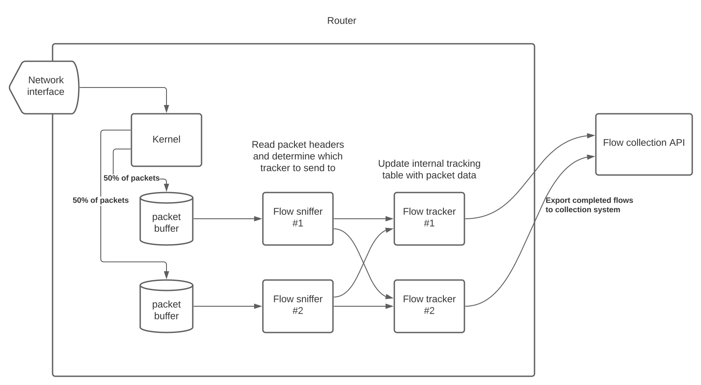

In my spare time I've been working on some tools written in Go which sniff network packets from enthusiast home routers and export flow metadata to a collection system running in AWS, allowing for real-time querying of network traffic.

The source code for the systems talked about in this post can be found at https://github.com/sheacloud/go-flowprobe and https://github.com/sheacloud/flowsys

## TL;DR

On-and-off over the past 1-2 years I've been building a collection of tools which allows for tracking network flows across my home router. The data is collected in real-time and exported to AWS for storage and analysis using some great off-the-shelf services like Athena and Quicksight.

There were a number of hurdles to overcome, including efficient packet capture on low-performance hardware, multi-threading a service which requires correlation of events between different threads, and a storage backend which can handle time-series data that needs to be queried based on a multitude of fields.

## Why this is of interest to me

One of my first projects as an intern at GDIT was to look into an open source tool, [SiLK](https://tools.netsa.cert.org/silk/), for network flow collection and analysis. At the time, we had a few hundred routers under our management and needed an easy way to ingest flowlogs from each of these devices so we could view traffic trends and troubleshoot connectivity issues. There are plenty of products on the market to fit this need, however most are priced based on devices sending logs, and our environment had an abnormally large number of network devices relative to the rest of the environment (we ran many small virtual routers in AWS to form a mesh network spanning hundreds of VPCs, prior to the days of Transit Gateway).

While SiLK ended up being an invaluable tool to our team, it highlighted some major pain points of legacy flowlog collection tools - a lack of modern redundancy, scalability, and security features. These flowlog collection tools often used proprietary or custom data storage formats which were not designed with high-availability or clustering in mind, meaning they often were only capable of being deployed to a single server, only allowing for vertical scaling. In addition, the protocols used to transmit the data - either IPFIx or Cisco's NetFlow, had no encryption or authentication options, raising security issues.

We eventually ended up moving away from our virtual router architecture towards a cloud-native solution with the release of AWS Transit Gateway, but my time spent working with flowlogs had left me wondering if it could be done better.

Fast-forward a few years and I'm still tinkering with network devices, building unnecessary home networking setups for the sake of learning new things, and trying to figure out the best way to get insight into the traffic going across my network.

## Alternative solutions

The most promising solution I've come across thus far is that of [elastiflow](https://github.com/robcowart/elastiflow), a solution based on the ELK stack. I ran this system for about a year and it performed well, however the upkeep was quite complicated (running an ELK cluster isn't cheap, both in terms of time and money). The project has also been deprecated in favor of a commercial offering under the same name. All-in-all this solution was a bit too expensive for a simple home-networking side project.

## Development of flowsys & go-flowprobe

After using elastiflow for about a year, I started to question how much work it would be to implement a solution of my own. I started looking into libraries for collecting netflow data and came across [cloudflare's goflow project](https://github.com/cloudflare/goflow), a Go library for reading netflow records and writing them to a downstream source in the form of protobufs. This caught my eye, and I started work on developing a collection agent which implemented a new downstream data transport to simply store the logs in AWS Cloudwatch rather than streaming them to Kafka.

After getting this code up and running, I started trying to integrate it with my home network. At the same time as all of this, I had decided to purchase a Ubiquiti UDM pro router as an upgrade to my Mikrotik router. To my surprise, the Ubiquiti router had no native support for netflow logging of any kind! This quickly ruined my plans of building this network traffic analysis system, until I came across one feature that it did have - the ability to run arbitrary software on the router in the form of containers. After seeing that some other people had been able to install ntopng, an open source network analysis tool, on the UDM Pro, I realized that I too would be able to get flowlogs exported, albeit in a much more hands-on approach.

### Building a custom flow aggregator & exporter

Having realized that I would have the option to implement my own solution for inspecting packets and exporting metadata, I began playing around with performing packet captures on the router from code running inside a container on the device. This turned out to be a lot easier than I expected thanks to [gopacket](https://pkg.go.dev/github.com/google/gopacket), allowing for a nice interface to sniff packets and pull protocol information from them.

The major difficulty in building code which inspected all packets flowing across a router was doing so in an efficient manor. The router I was working on could handle > 1Gbps throughput, and with a gigabit internet connection of my own, own of my primary requirements was to implement a solution which didn't degrade the performance of the router significantly. The problem is that routers have specialized circuits meant for forwarding packets - the second you take that packet and force it through the operating system, into user space, and bounce it around in memory, your performance tanks. They key was being able to read bits of data from the packet while having it take the shortest possible path through memory/the OS. Being able to inspect the packets as quickly as they came in at the max throughput manageable by the router is sometimes referred to as working at "wire speed"

The key to achieving this wire-speed inspection was to use what's referred to in packet-capturing land as zero-copy PCAPs. This is where memory-mapping is used to share a chunk of memory from kernel space into user space, allowing applications to read packet data directly from the kernel without a need for system interrupts or memory copies.

#### gopacket and zero-copy PCAP modules

gopacket offers 2 implementations of zero-copy packet captures, [PF_RING](https://www.ntop.org/products/packet-capture/pf_ring/) and [AF_PACKET](https://www.kernel.org/doc/html/latest/networking/packet_mmap.html#why-use-packet-mmap). 

PF_RING is a kernel module developed by ntop which implements memory-mapping from a circular buffer in kernel space to an applications memory. The network device drivers write the packets directly to this circular buffer, and so applications can read the packet data directly without any copies.

The primary issue with PF_RING is that it is a kernel module, and the packet sniffing agent I'm developing is running as a container on the device. This means my code is dependent on the underlying systems kernel modules, and Ubiquiti uses a read-only filesystem approach to their devices, meaning getting new kernel modules installed reliably is a bit of a headache.

The other solution is AF_PACKET, something which is baked into current linux kernels. AF_PACKET operates in much the same way as PF_RING, mapping a chunk of kernel memory directly into the userspace memory.

AF_PACKET worked seamlessly inside of the container (after setting the network configuration on the container to "host" to give it direct access to the hosts network interfaces). This enabled me to write code which efficiently scanned all the packets which crossed the router.

##### Performance side-notes

There are some added complexities when using zero-copy PCAPs, mainly around the fact that the packet data lives in a circular buffer owned by the kernel/network device, meaning steps need to be taken to ensure that 1. you aren't accidentally copying the data out of that buffer, and 2. that the data in the buffer isn't being overridden before you are done processing it.

The first issue is relatively easy to solve, the data inside a slice in Go is always passed around as a pointer, so passing a []byte object around functions is fine, as it won't copy the underlying slice contents.

The later issue requires active design consideration. Each call to the gopacket library to fetch packet data has the consequence of potentially invalidating the []byte slices previously returned by calls to the same function (the function just returns a pointer to some place in the circular buffer). This becomes an issue when trying to process packets across multiple threads, as you become limited to processing the packet in it's entirety before fetching the next one, meaning you can't pass the packet data into a pool of worker threads that process multiple packets at the same time.

The way to get around this limitation is to use multiple packet sniffers (each with their own buffer), and have packets distributed among them via a fanout option in the AF_PACKET setup. This is documented in detail at https://www.kernel.org/doc/html/latest/networking/packet_mmap.html#af-packet-fanout-mode, but at a high level you spread packets out among multiple packet sniffers, allowing each one to run in parallel without risking conflicts.

#### Building the flow tracker

The following is a high-level architecture of the flow tracking system. Multiple flow sniffing threads receive packets, calculate hashes, and sent the packets to flow tracking threads. The threads track the packets state in a table, keeping track of bytes, packets, etc of the entire flow. When a flow is determined to be 'complete' (either via timeout or TCP state completions), the flow is exported via an HTTP API to a collection system

As mentioned in the previous section, we are able to track packets in parallel threads, which is great for performance on modern systems with many CPU cores. The issue is that we need to track the flows as an aggregate of the entire router, meaning packets which get sniffed in one thread need to be correlated with packets sniffed in another thread.

To do this, we need a central flow tracking table, or at least a way of determining which flow tracking table to send packets to. We can still maintain multiple flow tracking tables, split across multiple threads, so long as the sniffing threads can determine which flow tracker to send the packet to. In general, we can achieve this by hashing some of the packets pertinent details, i.e. the source and destination addresses/ports, and using that hash to index into a list of flow tracking tables. This ensures that packets of the same flow are always sent to the same table, but also lets us alleviate mutex lock contention by having multiple flow trackers in separate threads, so not every packet is waiting on the same lock before being processed.

One thing which muddies these waters is the desire to track the return communications of a flow - this is where you're tracking the bytes/packets sent in response to some flow, where the source and destination fields are inverted. In our original solution, we run into a problem where the return flows may be sent to a different flow tracking table, meaning the data is no longer matched up. Luckily, there are hashing algorithms which result in the same hash for the forward and reverse flows, meaning the response traffic packets will always be sent to the same underlying flow table. https://pkg.go.dev/github.com/google/gopacket#Flow.FastHash implements such a symmetric hashing algorithm, and is non-cryptographic so it is built to be fast, not secure (fine for our purposes of load-balancing packets between threads)

### Building a flow collection and analysis service

The second, and equally important component of the flow analytics system is the collection system. Throughout the lifespan of this project I've toyed with a variety of approaches, both for the transport mechanism and the storage backend. Currently I've settled on the more simplistic approach, but I'll talk a little about the different options I tried and where they fell short.

#### Early iterations of the project

At the beginning, I tried using IPFIX as the transport protocol for sending the flow information to a central system. VMWare has a new open source implementaiton of the IPFix protocol in Go (https://github.com/vmware/go-ipfix) which implements both a producer and consumer, and can support TLS encryption and authentication, however using non-HTTP transport limited the cloud hosting options as you had to use network-layer load balancing and couldn't take advantage of serverless options like Lambda. For a side-project system, this requirement of always-on infrastructure was significantly more expensive than the serverless counterpart, so eventually I decided to ditch IPFix and implement a very basic HTTP API for transporting flows.

As for the data storage, I had spent a lot of time investigating optimal database engines for storing network flows. Network flows have a very defined access pattern - they follow a strict WORM model (write once, read many), they often need to be indexed by time (you often want to search recent traffic flows, not all traffic flows), and you write the data in chronological order. While a traditional SQL database could certainly handle the amount of traffic being generated by a home network, they are far from optimal for this access pattern. Some projects have been spun off based on SQL databases to be fine-tuned to handle time-series data like this (i.e. Timescale DB), however these are often complex systems to deploy that require a lot of maintenance and are meant for truly massive scale.

AWS offers a managed time-series database, timestream, however this is more suited for IoT sensor data, where the cardinallity of the data is much lower than that of network flows. You might have millions of IoT sensors, but there are orders of magnitude more possible flow combinations (2^32 sources x 2^32 destinations, not factoring in ports, and that's just IPv4). This has performance impacts on many database systems that rely on indexing based on these attributes.

I looked briefly into NoSQL solutions such as DynamoDB, however these key-value databases suffered from an issue of needing to index the data on too many different attributes. It's common to want to query all flowlogs across a given time range, making flow time a great index candidate, however it is just as useful to be able to query off of the IPs in the flow, the ports, or the amount of data transmitted in the flow. Indexing based on every field had performance and cost impacts, and it ended up being both slow and expensive to store individual flows in.

#### Current solution - Lambda, Kinesis, S3 and Quicksight

Eventually I ended up trying out a much simpler approach to the data storage, one which I had used for a different project, cloud-inventory. This system used many data files in the Parquet format, stored in S3, as the data storage tier. Indexing was achieved using a directory structure based on primarily on time (folders for each year/month/day and optionally hour). AWS Athena (which is just a managed offering of PrestoDB) can be used to query these Parquet files with decent performance, but great scale. While Athena has a high initial latency (nothing runs in under half a second at best), it can scan tens of thousands of these data files in a matter of seconds, allowing for very easy querying. In addition, Athena provides a out-of-the-box query engine and interface, so all I have to worry about is writing the data to these files in S3.

An added benefit is that AWS has a visualization service, Quicksight, which natively integrates with Athena, allowing us to create quick visuals of the network traffic with no need for custom UIs or web hosting.

To load the data into S3 from the API endpoints, I take advantage of Kinesis data streams & firehose. Kinesis is a fully managed pub/sub messaging service, similar to Kafka. By writing each flow event to the Kinesis data stream, I can leverage a built-in AWS offering called Firehose which will transform these JSON records in Apache Parquet format and write them to S3, indexed by their timestamp. This allows for a low-code solution to getting the data into a format which can be queried by Athena, and also opens up the ability to add further real-time data analytics applications which process data from this Kinesis stream to generate alerts, etc.

## Moving forward

I've just got the flow tracking and data collections systems to be stable, so now I am in the process of letting it collect a decent amount of data from my home network.

The next major step is to begin enriching the data as it comes in, adding more human-friendly fields to the data such as hostnames rather than IPs, and geo-location data. Adding hostname information is a difficult problem to solve (especially with the onset of TLS1.3 and QUIC as they aim to hide hostname information from network devices along the data path).

Past that I hope to begin using Quicksight to visualize the data that is being collected and provide insights into any trends in it.