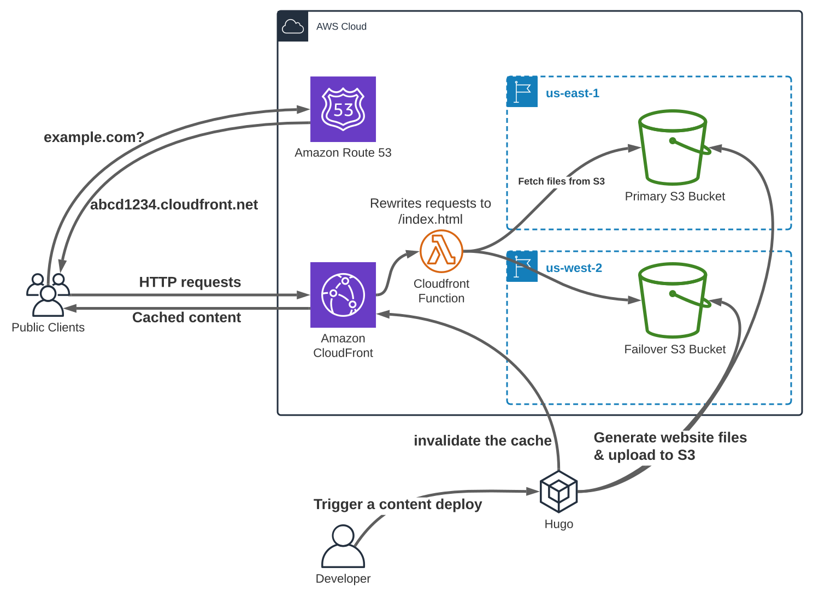

I recently decided to set up a personal website to showcase some of the projects I've been working on, and get a better hands-on understanding of static content hosting.

In this post I'll walk through how I got the site set up, what technologies are being used, and some of the issues I ran into.

All of the code for both the website, and the terraform used to deploy the website, can be found [here](https://github.com/sheacloud/blog)

## Tech Stack

I've never been much of a front-end developer, so finding a static site generator like [hugo](https://github.com/gohugoio/hugo) was a big relief. I decided to host the content myself on AWS as I'm very familiar with that ecosystem, so it was a nice balance of new-and-comfortable.

Hugo generates a bunch of files which comprise the entire website (indexes, html pages, css style sheets, etc), meaning the only thing necessary from a web server is to serve these static files - there's no need for server-side processing. This opens up the option for a very low-cost, low-maintenance hosting solution like AWS S3 static website hosting.

By uploading all the static files that Hugo generates to an S3 bucket (something Hugo has native support for), we can allow AWS to serve these files from their infrastructure while only paying for the long-term data storage, and per-request fees. For a small personal website, this is negligible

To optimize the performance and add a layer of security, we can put AWS CloudFront in front of the S3 bucket to act as a CDN, providing caching, SSL, DDOS protection, and multi-region failover capabilities

## Architecture

### Multi-region failover

CloudFront lets you define failover scenarios for if the primary backend (aka origin) is down. Based on this, we can configure 2 S3 buckets in separate regions, and tell CloudFront to pull from one S3 bucket primarily, and then failover to the second bucket if there are issues with the first (4xx/5xx errors).

While this seems like an ideal option, there are some considerations that need to be taken into account when setting this up. For one, a single-region setup likely more than sufficient for most small website availability requirements. S3 is a distributed service running across multiple data centers within a given region, and outages where data has been inaccessible are very rare ([but not non-existent](https://aws.amazon.com/message/41926/)). If you can tolerate the potential few-hour-long outages here and there, then it's probably better to just stick with one bucket, in one region, and not worry about data replication/synchronization.

If no downtime is acceptable, then a secondary S3 bucket can be built in another region, as shown in the diagram. This bucket, along with the primary bucket, are then added to a CloudFront origin group. The origin group is then configured with a list of criteria for when to attempt to fetch the file from the secondary bucket, in most cases these are 403s, 404s, and 5xx errors. In this setup, should one of the S3 buckets go down and start throwing errors or timeouts when trying to fetch objects, CloudFront will automatically send the request to the secondary bucket instead. Additionally, should there be data loss in the primary bucket (accidental deletion or otherwise), the S3 requests will return 403s/404s, causing a failover event to the secondary bucket. See [the terraform configuration](https://github.com/sheacloud/blog/blob/main/terraform/cloudfront.tf) to see how this is set up in code.

The downsides to this approach are that you know have to keep data in sync between the 2 buckets, the architecture becomes more complex, and data storage costs are doubled.

To keep the data in sync, you can either set up multiple deployments within Hugo, or configure S3 bucket replication from the primary bucket to the secondary. The Hugo approach allows for instant replication of the data to the secondary bucket, however requires an additional "hugo deploy" invocation, potentially leading to cases where developers push to one bucket but not the other. The S3 bucket replication option, on the other hand, is completely automated, however can have a long delay between a file being written, and that file being replicated.

### Default Directory Indexes

While CloudFront has pretty seamless integration with S3, there is one major missing piece of functionality which impacts static content websites like Hugo - a lack of default directory indexes.

When a user sends a request to https://sheacloud.com, CloudFront needs to go and find a file in S3 that corresponds to that URL. When the URL is just the base domain name, CloudFront will let you specify a different file, often times "index.html", to fetch instead.

This works for the base domain name, but when a request is sent to a subdirectory, such as https://sheacloud.com/posts/, then CloudFront suddenly tries to fetch an object from S3 with the name "posts/", only problem being that this file doesn't exist - the file we really want is https://sheacloud.com/posts/index.html

CloudFront has no native way to specify default directory index files, unlike certain web servers like Apache. Hugo builds most of it's page URLs as subdirectories, not actual files, so this becomes a big problem.

To solve this issue, we can use CloudFront functions - a feature of CloudFront which lets you write simple Javascript functions that get executed against each HTTP request made to the website. These functions allow us to rewrite the URL of requests being made, so that when we see a request to a subdirectory, we can change it to the respective index.html file instead.

This solution is based off [this AWS blog post](https://aws.amazon.com/blogs/compute/implementing-default-directory-indexes-in-amazon-s3-backed-amazon-cloudfront-origins-using-lambdaedge/), however leverages a newer feature, CloudFront functions, rather than Lambda@Edge. These CloudFront functions are easier and cheaper to deploy, but have more limited functionality.